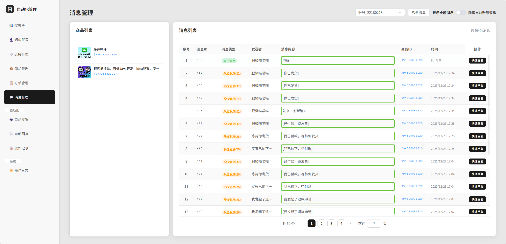
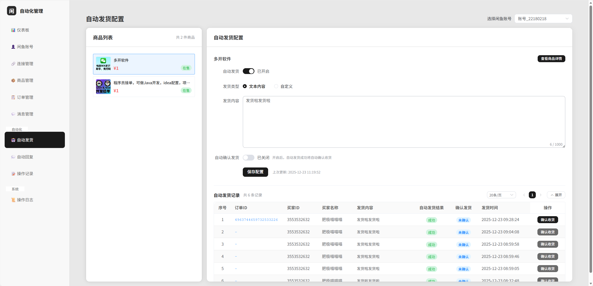
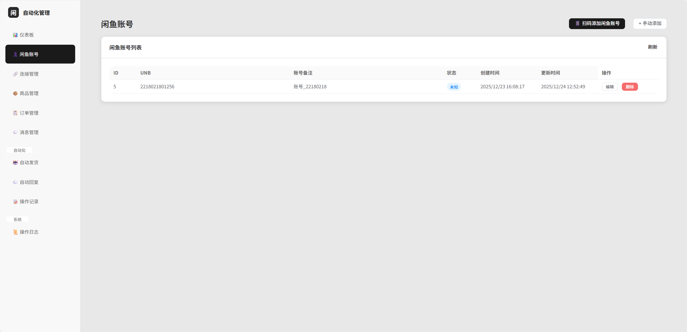
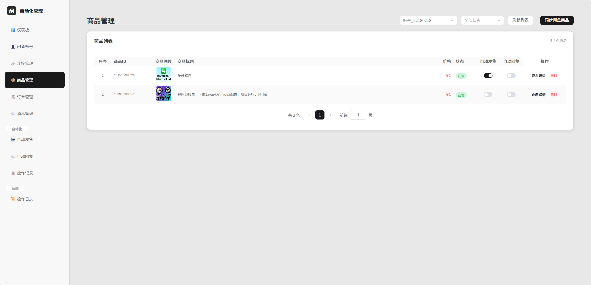

# 闲鱼自动化管理系统

<div align="center">


一个功能强大的闲鱼店铺自动化管理工具，支持自动发货、自动回复、消息管理等功能。

[功能特性](#功能特性) • [快速开始](#快速开始) • [使用指南](#使用指南) • [截图展示](#截图展示) • [技术栈](#技术栈) • [常见问题](#常见问题)

</div>

---

## 📸 截图展示

### 消息管理

查看聊天记录，支持快速回复和消息筛选：

<div align="center">
  
  <p><i>消息管理 - 聊天记录查看与快速回复</i></p>
</div>

### 自动发货配置

配置商品自动发货规则，支持自动确认收货：

<div align="center">
  
  <p><i>自动发货 - 配置发货内容与规则</i></p>
</div>

### 闲鱼账号管理

管理多个闲鱼账号，支持扫码登录：

<div align="center">
  
  <p><i>账号管理 - 多账号统一管理</i></p>
</div>

### 商品管理

同步和管理闲鱼商品，配置自动化功能：

<div align="center">
  
  <p><i>商品管理 - 商品列表与配置</i></p>
</div>

---

## 📋 功能特性

### 核心功能

- 🔐 **多账号管理** - 支持同时管理多个闲鱼账号，轻松切换
- 🔗 **WebSocket连接** - 实时监听闲鱼消息，及时响应买家
- 🚀 **自动发货** - 买家付款后自动发送发货信息，节省时间
- 💬 **自动回复** - 智能匹配关键词，自动回复买家消息
- 📦 **商品管理** - 同步商品信息，统一管理在售商品
- 📋 **订单管理** - 查看订单列表，支持一键确认收货
- 💌 **消息管理** - 查看聊天记录，支持快速回复

### 高级功能

- 🔄 **Token自动刷新** - 智能维护登录状态，随机间隔避免检测
- 📊 **数据统计** - 实时查看账号、商品、订单等数据统计
- 📜 **操作日志** - 详细记录所有操作，方便追踪和排查
- 🎯 **消息过滤** - 支持按商品、账号筛选消息
- 🔐 **滑块验证处理** - 智能检测验证需求，提供详细操作指引

---

## 🚀 快速开始

### 环境要求

- **Java**: 17 或更高版本
- **Node.js**: 20.19.0 或更高版本
- **Maven**: 3.6+ (可选，项目包含 Maven Wrapper)

### 安装步骤

#### 1. 克隆项目

```bash
git clone https://github.com/your-username/xianyu-assistant.git
cd xianyu-assistant
```

#### 2. 构建前端

```bash
cd vue-code
npm install
npm run build
cd ..
```

#### 3. 启动后端

**使用 Maven Wrapper (推荐)**

```bash
# Windows
mvnw.cmd spring-boot:run

# Linux/Mac
./mvnw spring-boot:run
```

**或使用 Maven**

```bash
mvn spring-boot:run
```

#### 4. 访问应用

打开浏览器访问: `http://localhost:12400`

---

## 📖 使用指南

### 快速上手

#### 1️⃣ 添加闲鱼账号

- 进入"闲鱼账号"页面
- 点击"扫码登录"按钮
- 使用闲鱼APP扫描二维码
- 等待登录成功

#### 2️⃣ 启动WebSocket连接

- 进入"连接管理"页面
- 选择要连接的账号
- 点击"启动连接"按钮
- 等待连接成功

> ⚠️ **注意**: 如果遇到滑块验证，请按照弹窗提示操作：
> 1. 访问闲鱼IM页面完成验证
> 2. 点击"❓ 如何获取？"按钮查看教程
> 3. 手动更新Cookie和Token

#### 3️⃣ 同步商品信息

- 进入"商品管理"页面
- 选择已连接的账号
- 点击"刷新商品"按钮
- 等待商品同步完成

#### 4️⃣ 配置自动化功能

- 在商品列表中找到目标商品
- 开启"自动发货"或"自动回复"
- 配置发货内容或回复规则
- 保存配置，自动化开始工作

### 功能说明

#### 自动发货

当买家付款后，系统会自动检测到"已付款待发货"消息，并根据配置自动发送发货信息。

**配置步骤**:
1. 进入"自动发货"页面
2. 选择商品，点击"配置"
3. 输入发货内容（支持文本）
4. 可选：开启"自动确认收货"
5. 保存配置

#### 自动回复

智能匹配买家消息中的关键词，自动发送预设的回复内容。

**配置步骤**:
1. 进入"自动回复"页面
2. 选择商品，点击"添加规则"
3. 设置关键词和回复内容
4. 选择匹配方式（精确/模糊）
5. 保存规则

#### Token刷新策略

系统采用随机间隔刷新策略，避免被检测为机器人：

- **_m_h5_tk**: 1.5-2.5小时随机刷新
- **websocket_token**: 10-14小时随机刷新
- **账号间隔**: 2-5秒随机

---

## 🛠️ 技术栈

### 后端

- **Spring Boot 3.x** - 应用框架
- **MyBatis-Plus** - ORM框架
- **SQLite** - 嵌入式数据库
- **WebSocket** - 实时通信
- **Lombok** - 简化代码

### 前端

- **Vue 3** - 渐进式框架
- **TypeScript** - 类型安全
- **Element Plus** - UI组件库
- **Vite** - 构建工具
- **Axios** - HTTP客户端
- **Pinia** - 状态管理

---

## 📁 项目结构

```
xianyu-assistant/
├── src/main/java/                    # Java源代码
│   └── com/feijimiao/xianyuassistant/
│       ├── controller/                # 控制器层
│       ├── service/                   # 服务层
│       ├── mapper/                    # 数据访问层
│       ├── entity/                    # 实体类
│       ├── websocket/                 # WebSocket处理
│       ├── event/                     # 事件监听
│       └── exception/                 # 异常处理
├── src/main/resources/
│   ├── static/                        # 前端构建产物
│   └── application.yml                # 配置文件
├── vue-code/                          # 前端源代码
│   ├── src/
│   │   ├── views/                     # 页面组件
│   │   ├── components/                # 公共组件
│   │   ├── api/                       # API接口
│   │   ├── utils/                     # 工具函数
│   │   └── types/                     # 类型定义
│   └── public/                        # 静态资源
├── dbdata/                            # 数据库文件
└── logs/                              # 日志文件
```

---

## 🐳 Docker部署

推荐使用Docker部署，简单快捷！

### 本地部署

详细说明请查看 [Docker部署指南](DOCKER_DEPLOY.md)

```bash
# 克隆项目
git clone https://github.com/your-username/xianyu-assistant.git
cd xianyu-assistant

# 启动服务
docker-compose up -d

# 查看日志
docker-compose logs -f
```

访问: `http://localhost:12400`

### 服务器部署

如需部署到服务器，请查看 [服务器部署指南](SERVER_DEPLOY.md)

**快速部署到服务器：**

```bash
# 1. SSH连接到服务器
ssh username@your-server-ip

# 2. 安装Docker（如未安装）
curl -fsSL https://get.docker.com | sh

# 3. 克隆并启动
cd /opt
git clone https://github.com/your-username/xianyu-assistant.git
cd xianyu-assistant
docker compose up -d
```

**更多内容:**
- [完整Docker部署指南](DOCKER_DEPLOY.md)
- [服务器部署详细步骤](SERVER_DEPLOY.md)
- [故障排查](DOCKER_DEPLOY.md#故障排查)
- [生产环境配置](DOCKER_DEPLOY.md#生产环境部署建议)

---

## ❓ 常见问题

### 1. WebSocket连接失败怎么办？

**解决方案**:
1. 检查Cookie是否有效
2. 尝试手动更新Token
3. 如果提示需要滑块验证，访问 https://www.goofish.com/im 完成验证后手动更新Cookie和Token

### 2. 如何获取Cookie和Token？

点击连接管理页面中Cookie和Token区域的"❓ 如何获取？"按钮，查看详细的图文教程。

### 3. 自动发货什么时候触发？

当买家付款后，系统会自动检测到"已付款待发货"消息，并根据配置自动发送发货信息。

### 4. Token过期了怎么办？

系统会自动刷新Token（1.5-2.5小时刷新一次），也可以在连接管理页面手动更新。

### 5. 为什么不建议频繁启动/断开连接？

频繁操作容易触发闲鱼的人机验证，导致账号暂时不可用。建议保持连接稳定。

---

## 📝 开发指南

### 前端开发

```bash
cd vue-code
npm install
npm run dev
```

访问: `http://localhost:5173`

### 后端开发

```bash
mvn spring-boot:run
```

访问: `http://localhost:12400`

### 构建生产版本

```bash
# 构建前端
cd vue-code
npm run build

# 构建后端
cd ..
mvn clean package
```

---

## 🤝 贡献指南

欢迎提交Issue和Pull Request！

1. Fork本项目
2. 创建特性分支 (`git checkout -b feature/AmazingFeature`)
3. 提交更改 (`git commit -m 'Add some AmazingFeature'`)
4. 推送到分支 (`git push origin feature/AmazingFeature`)
5. 提交Pull Request

---

## 📄 许可证

本项目采用 MIT 许可证 - 查看 [LICENSE](LICENSE) 文件了解详情

---

## ⚠️ 免责声明

本项目仅供学习交流使用，请勿用于商业用途。使用本工具产生的任何后果由使用者自行承担。

---

## 📧 联系方式

如有问题或建议，欢迎通过以下方式联系：

- 提交 [Issue](https://github.com/your-username/xianyu-assistant/issues)
- 发送邮件至: your-email@example.com

---

<div align="center">

**如果这个项目对你有帮助，请给个 ⭐️ Star 支持一下！**

Made with ❤️ by [Your Name]

</div>
